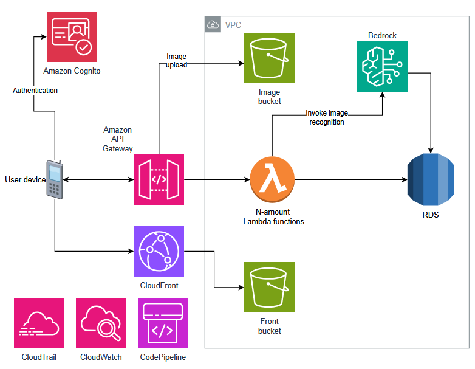
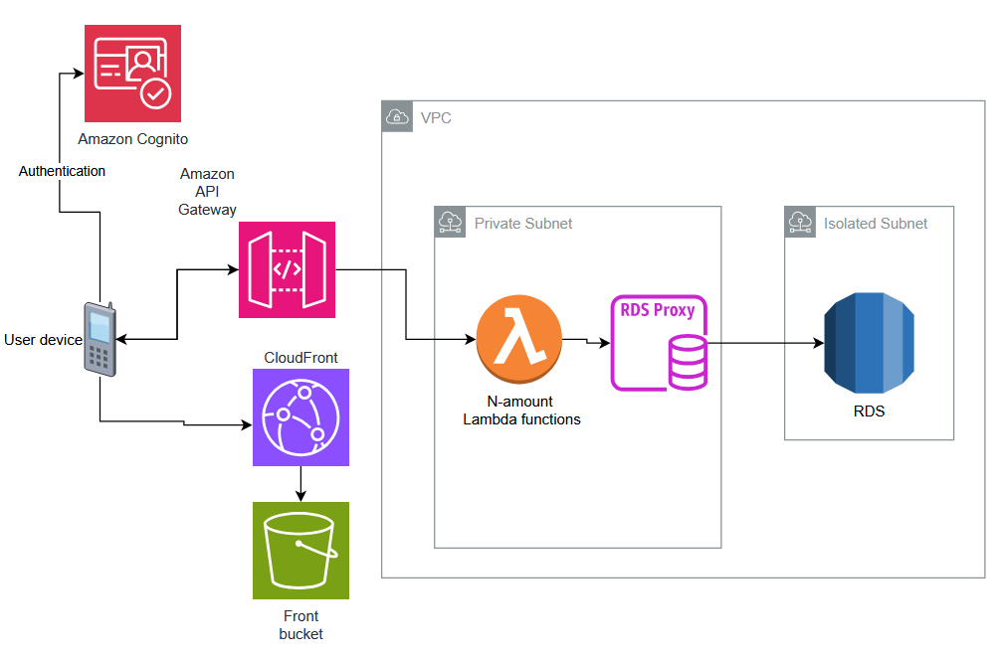

# Portfolio

## Sisällysluettelo

1.  [Pilvi-infrastruktuuri](#1-pilvi-infrastruktuuri)
2.  [Testaus](#2-testaus)
3.  [Automaatio](#3-automaatio)
4.  [Muuta satunnaista](#4-muuta-satunnaista)
5.  [Tavoitteet](#5-tavoitteet)

## 1. Pilvi-infrastruktuuri

### Suunnitelmat

Projektin alkaessa pilvi-infrastruktuurista keskusteltiin ryhmän tekniikkajäsenten kesken; päädyimme kokeilemaan serverless-ratkaisua, koska halusimme haastaa itseämme. B-suunnitelmana suunniteltiin myös perinteisempi palvelinratkaisu (EC2-pohjainen). Ensimmäinen versio infrastruktuurisuunnitelmasta saatiin toteutettua aikaisin, mutta huomioimatta jäi se, miten sovellus saadaan käyttäjän laitteelle. Tämä korjattiin opettajan palautteen ansiosta. Alla on kuva ensimmäisestä käyttövalmiista suunnitelmasta.



Lyhyesti selitettynä: käyttäjä pääsee sivulle CloudFrontin kautta S3:een tallennettuun sivuun, jonka jälkeen käyttäjä autentikoituu Cogniton avulla. Autentikoitu käyttäjä voi käyttää API Gatewayn kautta Lambda-funktioita, jotka keskustelevat RDS-tietokannan kanssa. Tarkoituksena oli myös implementoida omien kuvien tallentaminen sekä kuvatunnistusominaisuus Bedrockin avulla.

Projektin alkuvaiheessa kuitenkin ymmärrettiin, että toiminnallisuuksia tulee rajata rajallisen ajan vuoksi. Kuvantunnistusominaisuus rajattiin pois toteutuksesta. Myös koodikäytänteitä sovittaessa päädyttiin käyttämään Github Actionseja CodePipelinen sijaan. Lisäksi backend-kehityksessä ilmeni toive lisätä RDS Proxy infrastruktuuriin tietokantalatenssin välttämiseksi. Alla olevassa kuvassa näkyvät nämä muutokset.



### Hinta-arviot

Projektin alkuvaiheessa tehtiin arvio infrastruktuurin kuluista. Arvio perustui suunniteltuun infrastruktuuriin. Valitut resurssit eivät kuitenkaan kuvastaneet oikeassa käytössä valittuja, vaan olivat resurssi-intensiivisempiä ja sen takia kalliimpia. Oletuksena oli myös, että infrastruktuuria pidetään käynnissä vain työaikoina. Ensimmäinen arvio oli, että kulutus olisi noin 23 € kuussa. Todellisuudessa keskimääräinen kulutus oli noin 20 € kuussa. Arvio oli yllättävän realistinen huomioiden epävarmuuden suunnittelussa.

Kulutuksen vähentämisessä hyödynnettiin infrastruktuurin pystytystä ja tuhoamista IaC-templaattien avulla. Tulevaisuudessa projektin parissa voitaisiin miettiä EventBridgen hyödyntämistä esim. tietokannan pysäyttämiseen ajoitetusti.

### Ongelmatilanteet

Pilvi-infrastruktuurin parissa ilmeni hyvin vähän ongelmia. Omista ongelmista kuitenkin mainittakoon tässä kaksi merkittävää tapausta:

- Aliverkkorakenteen takia hyppykoneen käyttäminen osoittautui hankalaksi RDS-tietokannan kanssa. Tapausta hankaloitti se, että käytimme RDS Proxyä. Lopulta ongelma kierrettiin luomalla migrations-lambda, jolla tietokantaan syötetään pystytyksen yhteydessä dataa.
- RDS Proxy ei kuulu AWS:n Free Tierin palveluihin. Kyseinen palvelu saatiin kuitenkin alunperin pystytettyä CDK-templaatilla. Amazon tilkitsi tämän porsaanreiän projektin aikana, mikä johti orporesurssin syntymiseen sekä äkkinäiseen pilvi-infrastruktuurin muutokseen. Infrastruktuuri muutettiin sellaiseksi, että lambdat keskustelevat suoraan RDS-tietokannan kanssa.

### Mitä opin?

Opin sen, että dokumentaatiota seuraamalla saa rakennettua myös sellaisia infrastruktuureja, jotka eivät ole tyypillisiä. Kantapään kautta opin myös sen, että käyttöön otettavat palvelut kannattaa tarkistaa saatavuudeltaan (RDS Proxy!). Lisäksi opin paljon admin-työskentelystä AWS:n parissa. Ongelmatilanteisiin törmätessä suunnittelin muiden tekniikkavastaavien kanssa sen, miten ongelma korjataan tai kierretään.

Koin myös, että hyödynsin hyvin automaatiota pilven kanssa. Oli myös ilo huomata SQL- ja tietokantaosaamisen hyödyt, kun kyselyitä suunniteltiin. Parannettavaakin kuitenkin on: kulujen suunnitteluun ja seurantaan tulisi kiinnittää enemmän huomiota, kuten myös käyttäjiin liittyvään tietoturvaan.

## 2. Testaus

### Jasmine & Karma

Angular/Ionic-komponenttien testaus suoritettiin Jasminella ja Karmalla. Ratkaisuun päädyttiin, koska projektirakenteessa oli jo automaattisesti generoidut testit komponenteittain. Tavoitteena oli testata komponenttien päätoiminnallisuuksia. Alla on esimerkki Jasmine-testistä customers-page-komponentille. Testillä testataan filteredCustomers-funktion toimivuus.

```
import { ComponentFixture, TestBed } from '@angular/core/testing';
import { HttpClientTestingModule } from '@angular/common/http/testing';
import { provideRouter } from '@angular/router';
import { CustomersPage } from './customers.page';

describe('CustomersPage', () => {
  let component: CustomersPage;
  let fixture: ComponentFixture<CustomersPage>;

  beforeEach(async () => {
    await TestBed.configureTestingModule({
      imports: [HttpClientTestingModule, CustomersPage],
      providers: [provideRouter([])],
    }).compileComponents();

    fixture = TestBed.createComponent(CustomersPage);
    component = fixture.componentInstance;
    fixture.detectChanges();
  });

  it('should filter customers by search term', () => {
    component.allcustomers = [
      //mock customers; follows Interface
      {
        customer_id: 1,
        first_name: 'Tapio',
        last_name: 'Testinen',
        email: 'tapio@example.com',
        phone: '0401234567',
        notes: 'Testiasiakas',
        User_user_id: 'test',
      },
      {
        customer_id: 2,
        first_name: 'Matti',
        last_name: 'Meikäläinen',
        email: 'matti@example.com',
        phone: '0507654321',
        notes: '',
        User_user_id: 'test',
      },
    ];

    component.searchItem = 'tapio';
    let result = component.filteredCustomers();
    expect(result.length).toBe(1);
    expect(result[0].first_name).toBe('Tapio');

    component.searchItem = 'meikäläinen';
    result = component.filteredCustomers();
    expect(result.length).toBe(1);
    expect(result[0].last_name).toBe('Meikäläinen');

    component.searchItem = 'matti@';
    result = component.filteredCustomers();
    expect(result.length).toBe(1);
    expect(result[0].email).toBe('matti@example.com');

    component.searchItem = '';
    result = component.filteredCustomers();
    expect(result.length).toBe(2);

    component.searchItem = 'xyz';
    result = component.filteredCustomers();
    expect(result.length).toBe(0);
  });
});
```

### Jest

CDK-templaattien toimivuus testattiin Jest-kirjaston avulla, implementoituna julkaisuputkeen muiden yksikkötestien tavoin. Alla on esimerkki database-stackin testaamisesta. Esimerkissä on myös huomioitavaa aiemman riippuvuuden simulointi.

```
import { App } from 'aws-cdk-lib';
import { Template } from 'aws-cdk-lib/assertions';
import { DatabaseStack } from '../lib/database-stack';
import * as ec2 from 'aws-cdk-lib/aws-ec2';
import { Stack } from 'aws-cdk-lib';

describe('DatabaseStack', () => {
  let app: App;
  let template: Template;

  // beforeEach hook to set up the app and stack before each test
  // need to set up a fake VPC as well since DatabaseStack requires it
  beforeEach(() => {
    app = new App();
    const vpcStack = new Stack(app, 'TestVpcStack');
    const vpc = new ec2.Vpc(vpcStack, 'TestVpc', {
      maxAzs: 1,
      subnetConfiguration: [
        {
          name: 'Public',
          subnetType: ec2.SubnetType.PUBLIC,
          cidrMask: 24,
        },
        {
          name: 'Private',
          subnetType: ec2.SubnetType.PRIVATE_WITH_EGRESS,
          cidrMask: 24,
        },
        {
          name: 'Isolated',
          subnetType: ec2.SubnetType.PRIVATE_ISOLATED,
          cidrMask: 24,
        },
      ],
    });
    const instanceClass = ec2.InstanceClass.BURSTABLE3;
    const instanceSize = ec2.InstanceSize.MICRO;
    const dbStack = new DatabaseStack(app, 'TestDatabaseStack', {
      vpc,
      rdsSecretName: 'test-secret',
      instanceClass,
      instanceSize,
    });
    template = Template.fromStack(dbStack);
  });

  // tests that a secret is created in Secrets Manager with the correct name
  it('should create secrets in Secrets Manager', () => {
    template.hasResourceProperties('AWS::SecretsManager::Secret', {
      Name: 'test-secret',
    });
  });

  // tests that an RDS instance is created with the correct properties
  it('should create an RDS instance', () => {
    template.hasResourceProperties('AWS::RDS::DBInstance', {
      DBInstanceClass: 'db.t3.micro',
      Engine: 'mysql',
    });
  });
});

```

### Mitä opin?

Vaikka en tehnyt testaussuunnitelmaa alussa, sain suoritettua testausta järjestelmällisesti. Onnistuin identifoimaan tärkeimmät paikat, joissa testaamista tarvitaan. Koodiin liittyvät muutokset kuitenkin usein rikkoivat testit, jotka oli kirjoitettu aikaisessa vaiheessa projektia, ja aikataulusyistä näitä testejä mm. kommentoitiin pois. Testit oli toisaalta implementoitu järkevästi, koska yksikkötestit suoritettiin julkaisuputkessa automaattisesti. Testit suorittamalla jokaisen pushin yhteydessä löydettiin useita ongelmakohtia koodissa.

Toiseksi ongelmakohdaksi nousi modaalikomponentit. Käytännössä kaikki modaalikomponentit jäivät yksikkötestien sijaan e2e-testien testattaviksi. Lopulta kuitenkin myös e2e-testit jäivät implementoimatta lopputuotteelle, koska Cognito-ominaisuuden lisääminen koodissa esti Cypressiltä pääsyn sisäänkirjautumaan. Mikäli aikaa olisi ollut enemmän, eikä tarvetta siirtyä muihin työtehtäviin, olisin voinut käyttää lisätunteja ongelman ratkomiseen.

## 3. Automaatio

Mitä opin? Vahvuudet tässä?

Miksi valitsin nämä esimerkit?

### Github Actions Workflows

Github Actions workflows (deploy to s3 from hosting).

### Datan hankinta

Robotista pieni pätkä.

## 4. Muuta satunnaista

Mitä opin? Vahvuudet tässä?

Miksi valitsin nämä esimerkit?

### Mock data

Mock data (ja storen käyttö).

### Skriptit

Powershell.

### Frontend

Userpages.

## 5. Tavoitteet

### Reflektio

En ollut asettanut tarkkoja tavoitteita opintojaksolle, mutta halusin päästä tekemään Scrum Masterin tai Product Ownerin roolissa töitä, sekä oppia joitakin teknologioita lisää. En kuitenkaan päässyt SM:n tai PO:n rooliin. Testaajana pääsin kuitenkin oppimaan uusia testikirjastoja, ja lisäksi oma-aloittesesti panostin automaation opetteluun Githubissa. Opin myös Angularin perusteita.

Lisäksi opin myös paljon Gitin käytöstä tekemällä ryhmälle käyttöohjeet tyypillisiin tilanteisiin. Ongelmatilanteissa ratkoimme asiat yhdessä. Pilvi-infrastruktuurin suunnittelu ei ollut alkuperäisissä tavoitteissani, mutta sen tekeminen oli hyvä haaste itselleni. Toivoisin voivani myös myöhemmin työntää itseäni vielä enemmän mukavuusaluen ulkopuolelle oppimaan uutta.

### Tulevaisuus

Tulevaisuus; millainen työ, kuinka TC tuki tätä, mitä osaamista vielä tarvitsen?

[⬆ Back to top ](#portfolio)
